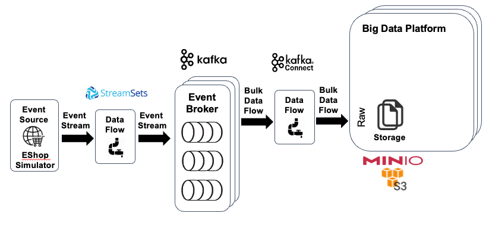

# Order Processing Data Lake Example

This sample shows the ingestion of data from Kafka into the raw layer in S3. From there the data can be processed using Spark and queried using Trino.  

## Moving Data from Kafka to S3 compliant Object Storage using Kafka connect



The [S3 Sink Connector](https://docs.confluent.io/kafka-connect-s3-sink/current/overview.html) is already pre-installed with the Dataplatform. You can check that by executing

```bash
curl --silent -X GET http://192.168.1.162:8083/connector-plugins | jq
```

```
[
  {
    "class": "io.confluent.connect.s3.S3SinkConnector",
    "type": "sink",
    "version": "10.0.7"
  },
  {
    "class": "io.confluent.connect.storage.tools.SchemaSourceConnector",
    "type": "source",
    "version": "7.0.1-ccs"
  },
  {
    "class": "io.mdrogalis.voluble.VolubleSourceConnector",
    "type": "source",
    "version": "0.3.0"
  },
  {
    "class": "org.apache.kafka.connect.mirror.MirrorCheckpointConnector",
    "type": "source",
    "version": "1"
  },
  {
    "class": "org.apache.kafka.connect.mirror.MirrorHeartbeatConnector",
    "type": "source",
    "version": "1"
  },
  {
    "class": "org.apache.kafka.connect.mirror.MirrorSourceConnector",
    "type": "source",
    "version": "1"
  }
]
```

To create a connector, you can use the [REST API](https://docs.confluent.io/platform/current/connect/references/restapi.html) provided by Kafka Connect.

Create the connector to upload the `person-v1` topic to S3:

```bash
curl -X "POST" "$DOCKER_HOST_IP:8083/connectors" \
     -H "Content-Type: application/json" \
     --data '{
  "name": "s3-person",
  "config": {
      "connector.class": "io.confluent.connect.s3.S3SinkConnector",
      "partition.duration.ms": "300000",
      "flush.size": "2000",
      "topics": "person-v1",
      "tasks.max": "1",
      "timezone": "Europe/Zurich",
      "locale": "en",
      "partitioner.class": "io.confluent.connect.storage.partitioner.HourlyPartitioner",
      "schema.generator.class": "io.confluent.connect.storage.hive.schema.DefaultSchemaGenerator",
      "storage.class": "io.confluent.connect.s3.storage.S3Storage",
      "format.class": "io.confluent.connect.s3.format.avro.AvroFormat",
      "s3.region": "us-east-1",
      "s3.bucket.name": "datalake-demo-bucket",
      "topics.dir": "raw",
      "s3.part.size": "5242880",
      "store.url": "http://minio-1:9000",
      "key.converter": "org.apache.kafka.connect.storage.StringConverter"
  }
}'
```

Create the connector to upload the `address-v1` topic to S3:

```bash
curl -X "POST" "$DOCKER_HOST_IP:8083/connectors" \
     -H "Content-Type: application/json" \
     --data '{
  "name": "s3-address",
  "config": {
      "connector.class": "io.confluent.connect.s3.S3SinkConnector",
      "partition.duration.ms": "300000",
      "flush.size": "2000",
      "topics": "address-v1",
      "tasks.max": "1",
      "timezone": "Europe/Zurich",
      "locale": "en",
      "partitioner.class": "io.confluent.connect.storage.partitioner.HourlyPartitioner",
      "schema.generator.class": "io.confluent.connect.storage.hive.schema.DefaultSchemaGenerator",
      "storage.class": "io.confluent.connect.s3.storage.S3Storage",
      "format.class": "io.confluent.connect.s3.format.avro.AvroFormat",
      "s3.region": "us-east-1",
      "s3.bucket.name": "datalake-demo-bucket",
      "topics.dir": "raw",
      "s3.part.size": "5242880",
      "store.url": "http://minio-1:9000",
      "key.converter": "org.apache.kafka.connect.storage.StringConverter"
  }
}'
```

Create the connector to upload the `order-v1` topic to S3:

```bash
curl -X "POST" "$DOCKER_HOST_IP:8083/connectors" \
     -H "Content-Type: application/json" \
     --data '{
  "name": "s3-order",
  "config": {
      "connector.class": "io.confluent.connect.s3.S3SinkConnector",
      "partition.duration.ms": "30000",
      "flush.size": "5000",
      "topics": "order-v1",
      "tasks.max": "1",
      "timezone": "Europe/Zurich",
      "locale": "en",
      "partitioner.class": "io.confluent.connect.storage.partitioner.HourlyPartitioner",
      "schema.generator.class": "io.confluent.connect.storage.hive.schema.DefaultSchemaGenerator",
      "storage.class": "io.confluent.connect.s3.storage.S3Storage",
      "format.class": "io.confluent.connect.s3.format.avro.AvroFormat",
      "s3.region": "us-east-1",
      "s3.bucket.name": "datalake-demo-bucket",
      "topics.dir": "raw",
      "s3.part.size": "5242880",
      "store.url": "http://minio-1:9000",
      "key.converter": "org.apache.kafka.connect.storage.StringConverter"
  }
}'
```

Create the connector to upload the `order-item-v1` topic to S3:

```bash
curl -X "POST" "$DOCKER_HOST_IP:8083/connectors" \
     -H "Content-Type: application/json" \
     --data '{
  "name": "s3-orderitem",
  "config": {
      "connector.class": "io.confluent.connect.s3.S3SinkConnector",
      "partition.duration.ms": "300000",
      "flush.size": "5000",
      "topics": "orderitem-v1",
      "tasks.max": "1",
      "timezone": "Europe/Zurich",
      "locale": "en",
      "partitioner.class": "io.confluent.connect.storage.partitioner.HourlyPartitioner",
      "schema.generator.class": "io.confluent.connect.storage.hive.schema.DefaultSchemaGenerator",
      "storage.class": "io.confluent.connect.s3.storage.S3Storage",
      "format.class": "io.confluent.connect.s3.format.avro.AvroFormat",
      "s3.region": "us-east-1",
      "s3.bucket.name": "datalake-demo-bucket",
      "topics.dir": "raw",
      "s3.part.size": "5242880",
      "store.url": "http://minio-1:9000",
      "key.converter": "org.apache.kafka.connect.storage.StringConverter"
  }
}'
```

To check which connectors are running, you can either use the REST API as well

```bash
curl --silent -X GET http://192.168.1.162:8083/connectors | jq
```

or view it in Kafka Connect UI by navigating to http://dataplatform:28103

## Moving Data from Kafka to S3 compliant Object Storage using StreamSets DataCollector

**Note:** this has been replaced by Kafka Connect, as it does not proper batching on the S3 objects (very small objects).

In the 2nd step, we will be using [StreamSets Data Collector](https://streamsets.com/products/dataops-platform/data-collector/) to consume the data we have previously written to the Kafka topic and store it in minIO Object Storage (which is S3 compliant).


Navigate to <http://dataplatform:18630> to open StreamSets and create a new pipeline.

Add a `Kafka Multitopic Consumer` origin and a `Amazon S3` destination.

For the `Kafka Multitopic Consumer` configure these properties:

* Tab **Kafka**
  * **Broker URI**: `kafka-1:19092`
  * **Consumer Group**: `MultiTopicConsumer`
  * **Topic List**: `person-v1`, `address-v1`, `order-v1`, `orderitem-v1`
  * **Max Batch Size (records)**: `20000`
* Tab **Data Format**
  * **Data Format**: `Avro`
  * **Avro Schema Location**: `Confluent Schema Registry`
  * **Schema Registry URLs**: `http://schema-registry-1:8081`     
  * **Lookup Schema By**: `Embedded Schema ID`     

For the `Amazon S3` configure these properties (as the MinIO is part of the self-contained platform, we can put the Access key and Secret Access key here in the text):

* Tab **Amazon S3**
  * **Authentication Method**: `AWS Keys`
  * **Access Key ID**: `V42FCGRVMK24JJ8DHUYG`
  * **Secret Access Key**: `1234567890`
  * **Use Specific Region**: `X`
  * **Region**: `Other - specify`
  * **Endpoint**: `http://minio:9000`
  * **Bucket**: `datalake-demo-bucket`
  * **Common Prefix**: `raw`
  * **Partition Prefix**: `${record:attribute('location')}/year=${YYYY()}/month=${MM()}/day=${DD()}/hour=${hh()}`
  * **Object Name Suffix**: `avro`
  * **Delimiter**: `/`
  * **Use Path Style Address Model**: `X`
* Tab **Data Format**
  * **Data Format**: `Avro`
  * **Avro Schema Location**: `In Record Header`  
  * **Include Schema**: `X`
  * **Avro Compression Codec**: `Snappy`

Before we can now start the pipeline, we have to create the bucket in MinIO object storage. We can either do that in the MinIO Browser or through the s3cmd available in the `awscli` service.

```bash
docker exec -ti awscli s3cmd mb s3://datalake-demo-bucket
```

Start the pipeline in StreamSets. As soon as there are `10000` tweets available in the Kafka topic, the first object should be written out to MinIO object storage.

Navigate to the MinIO Browser on <http://dataplatform:9000> and check that the bucket is being filled.

## Processing Orders in real-time using ksqlDB

In the 3rd step, we will be using a Stream Analytics component called [ksqlDB](https://ksqldb.io/) to process the tweets form the `tweets-json` Kafka topic in real-time. ksqlDB offers a familiar SQL-like dialect, which we can use to query from data streams.


We first start the ksqlDB CLI and connect to the ksqlDB engine

``` bash
docker exec -it ksqldb-cli ksql http://ksqldb-server-1:8088
```

Now we have to tell ksqlDB the structure of the data in the topic, as the Kafka topic itself is "schema-less", the Kafka cluster doesn't know about the structure of the message. We do that by creating a STREAM object, which we map onto the Kafka topic `tweet-json`.

```sql
CREATE STREAM order_raw_s
WITH (KAFKA_TOPIC='order-v1', VALUE_FORMAT='AVRO');

CREATE STREAM order_item_raw_s
WITH (KAFKA_TOPIC='orderitem-v1', VALUE_FORMAT='AVRO');

CREATE STREAM person_raw_s
WITH (KAFKA_TOPIC='person-v1', VALUE_FORMAT='AVRO');

CREATE STREAM address_raw_s
WITH (KAFKA_TOPIC='address-v1', VALUE_FORMAT='AVRO');
```

```sql
describe order_raw_s;

Name                 : ORDER_RAW_S
 Field            | Type            
------------------------------------
 TERRITORYID      | VARCHAR(STRING)
 BILLTOADDRESSID  | VARCHAR(STRING)
 SHIPTOADDRESSID  | VARCHAR(STRING)
 CURRENCYRATEID   | VARCHAR(STRING)
 SUBTOTAL         | VARCHAR(STRING)
 TAXAMT           | VARCHAR(STRING)
 FREIGHT          | VARCHAR(STRING)
 TOTALDUE         | VARCHAR(STRING)
 ORDERID          | VARCHAR(STRING)
 BUSINESSENTITYID | VARCHAR(STRING)
 EVENTTIMESTAMP   | BIGINT          
------------------------------------
For runtime statistics and query details run: DESCRIBE <Stream,Table> EXTENDED;
```

```sql
ksql> describe order_item_raw_s;

Name                 : ORDER_ITEM_RAW_S
 Field             | Type            
-------------------------------------
 PRODUCTID         | VARCHAR(STRING)
 NAME              | VARCHAR(STRING)
 PRODUCTNUMBER     | VARCHAR(STRING)
 MAKEFLAG          | VARCHAR(STRING)
 FINISHEDGOODSFLAG | VARCHAR(STRING)
 COLOR             | VARCHAR(STRING)
 SAFETYSTOCKLEVEL  | VARCHAR(STRING)
 REORDERPOINT      | VARCHAR(STRING)
 STANDARDCOST      | VARCHAR(STRING)
 LISTPRICE         | VARCHAR(STRING)
 DAYSTOMANUFACTURE | VARCHAR(STRING)
 SELLSTARTDATE     | VARCHAR(STRING)
 ROWGUID           | VARCHAR(STRING)
 MODIFIEDDATE      | VARCHAR(STRING)
 ORDERID           | VARCHAR(STRING)
 EVENTTIMESTAMP    | BIGINT          
-------------------------------------
For runtime statistics and query details run: DESCRIBE <Stream,Table> EXTENDED;
```


We don't map all the properties of the tweet, only some we are interested in.

Now with the STREAM in place, we can use the SELECT statement to query from it

```sql
SELECT * FROM order_raw_s EMIT CHANGES;
```

We have to specify the emit changes, as we are querying from a stream and by that the data is continuously pushed into the query (so called push query).

We can also selectively only return the data we are interested in, i.e. the `id`, the `text` and the `source` fields.

```sql
SELECT subtotol, orderid FROM order_raw_s EMIT CHANGES;
```

Let's only see the orders which are > 5000. We have to cast to double because we are using the raw data.

```sql
SELECT subtotal, orderid FROM order_raw_s WHERE cast(subtotal AS DOUBLE) > 10000.00 EMIT CHANGES;
```

We can refine the data


```sql
CREATE STREAM order_s
WITH (kafka_topic='ref.order_v1', partitions=8, value_format = 'avro')
AS
SELECT CAST (TERRITORYID AS int)      AS territory_id
,   CAST(BILLTOADDRESSID AS bigint)   AS bill_to_address_id
,   CAST(SHIPTOADDRESSID AS bigint)   AS ship_to_address_id
,   CAST(CURRENCYRATEID AS bigint)    AS currency_rate_id
,   CAST(SUBTOTAL AS double)          AS sub_total
,   CAST(TAXAMT AS double)            AS tax_amt
,   CAST(FREIGHT AS double)           AS freight
,   CAST(TOTALDUE AS double)          AS total_due
,   CAST(ORDERID AS bigint)           AS order_id
FROM order_raw_s;
```

This produces a Stream Analytics job which now continuously run in the background and read from the `order_raw_s`, flattens the hashtags and produces the result into the newly created `order_s` stream.


```sql
SELECT sub_total, order_id FROM order_s WHERE sub_total  > 10000.00 EMIT CHANGES;
```


```sql
SELECT productid
	, count(*) AS count
FROM order_item_raw_s
WINDOW TUMBLING (SIZE 60 seconds)
GROUP BY productid
EMIT CHANGES;
```

```sql
SELECT productid
	, count(*) AS count
FROM order_item_raw_s
WINDOW TUMBLING (SIZE 60 seconds)
GROUP BY productid
EMIT FINAL;
```

By using the `EMIT FINAL`, we specify that we only want to get a result at the end of the window.

## Processing Data using Apache Spark

In the 4th step, we will be using [Apache Spark](https://spark.apache.org/) to process the tweets we have stored in object storage. We will be using Apache Zeppelin for executing the Apache Spark statements in an "ad-hoc" fashion.


Navigate to <http://dataplatform:28080> to open Apache Zeppelin and login as user `admin` with password `abc123!`. Create a new notebook using the **Create new note** link.

Now let's read all the data we have stored to MinIO object storage so far, using the `spark.read.format("avro").load` command

```scala
val personRawDf = spark.read.format("avro").load("s3a://datalake-demo-bucket/raw/person-v1/")
val addressRawDf = spark.read.format("avro").load("s3a://datalake-demo-bucket/raw/address-v1/")
val orderRawDf = spark.read.format("avro").load("s3a://datalake-demo-bucket/raw/order-v1/")
val orderitemRawDf =  spark.read.format("avro").load("s3a://datalake-demo-bucket/raw/orderitem-v1/")
```

Spark returns the result as a Data Frame, which is backed by a schema, derived from the JSON structure. We can use the `printSchema` method on the data frame to view the schema.

```scala
personRawDf.printSchema

root
 |-- BusinessEntityID: string (nullable = true)
 |-- PersonType: string (nullable = true)
 |-- NameStyle: string (nullable = true)
 |-- FirstName: string (nullable = true)
 |-- MiddleName: string (nullable = true)
 |-- LastName: string (nullable = true)
 |-- personID: string (nullable = true)
 |-- EventTimestamp: long (nullable = true)
 |-- year: integer (nullable = true)
 |-- month: integer (nullable = true)
 |-- day: integer (nullable = true)
 |-- hour: integer (nullable = true)
```


```scala
addresRawDf.printSchema

root
 |-- AddressID: string (nullable = true)
 |-- AddressLine1: string (nullable = true)
 |-- City: string (nullable = true)
 |-- StateProvinceID: string (nullable = true)
 |-- PostalCode: string (nullable = true)
 |-- personID: string (nullable = true)
 |-- EventTimestamp: long (nullable = true)
 |-- year: integer (nullable = true)
 |-- month: integer (nullable = true)
 |-- day: integer (nullable = true)
 |-- hour: integer (nullable = true)
```

```scala
orderRawDf.printSchema()

root
 |-- TerritoryID: string (nullable = true)
 |-- BillToAddressID: string (nullable = true)
 |-- ShipToAddressID: string (nullable = true)
 |-- CurrencyRateID: string (nullable = true)
 |-- SubTotal: string (nullable = true)
 |-- TaxAmt: string (nullable = true)
 |-- Freight: string (nullable = true)
 |-- TotalDue: string (nullable = true)
 |-- orderID: string (nullable = true)
 |-- businessEntityID: string (nullable = true)
 |-- EventTimestamp: long (nullable = true)
 |-- year: integer (nullable = true)
 |-- month: integer (nullable = true)
 |-- day: integer (nullable = true)
 |-- hour: integer (nullable = true)
```

```scala
orderItemRawDf.printSchema()

root
 |-- ProductID: string (nullable = true)
 |-- Name: string (nullable = true)
 |-- ProductNumber: string (nullable = true)
 |-- MakeFlag: string (nullable = true)
 |-- FinishedGoodsFlag: string (nullable = true)
 |-- Color: string (nullable = true)
 |-- SafetyStockLevel: string (nullable = true)
 |-- ReorderPoint: string (nullable = true)
 |-- StandardCost: string (nullable = true)
 |-- ListPrice: string (nullable = true)
 |-- DaysToManufacture: string (nullable = true)
 |-- SellStartDate: string (nullable = true)
 |-- rowguid: string (nullable = true)
 |-- ModifiedDate: string (nullable = true)
 |-- orderID: string (nullable = true)
 |-- EventTimestamp: long (nullable = true)
 |-- year: integer (nullable = true)
 |-- month: integer (nullable = true)
 |-- day: integer (nullable = true)
 |-- hour: integer (nullable = true)
```

Let`s see some records of the `personRawDf` data frame

```scala
personRawDf.show

+----------------+----------+---------+---------+----------+--------+--------+--------------+----+-----+---+----+
|BusinessEntityID|PersonType|NameStyle|FirstName|MiddleName|LastName|personID|EventTimestamp|year|month|day|hour|
+----------------+----------+---------+---------+----------+--------+--------+--------------+----+-----+---+----+
|           12932|        IN|    False|   Jaclyn|      null|     Sun|      -1| 1649353463156|2022|    4|  7|  20|
|           11648|        IN|    False|   Lauren|         E|Thompson|      -1| 1649353463188|2022|    4|  7|  20|
|           13003|        IN|    False|    Emily|      null|  Flores|      -1| 1649353463346|2022|    4|  7|  20|
|           16280|        IN|    False|    Casey|      null|     Xie|      -1| 1649353463480|2022|    4|  7|  20|
|           14253|        IN|    False|  Garrett|      null| Sanders|      -1| 1649353463535|2022|    4|  7|  20|
|            3796|        IN|    False|    Wyatt|         R|  Wright|      -1| 1649353463664|2022|    4|  7|  20|
|            9866|        IN|    False|    Julia|         L|  Nelson|      -1| 1649353463732|2022|    4|  7|  20|
|            8646|        IN|    False|    Tasha|         R|    Goel|      -1| 1649353463792|2022|    4|  7|  20|
|            8783|        IN|    False|Priscilla|      null|     Lal|      -1| 1649353463808|2022|    4|  7|  20|
|            4816|        IN|    False|    Lucas|      null|  Wright|      -1| 1649353463861|2022|    4|  7|  20|
+----------------+----------+---------+---------+----------+--------+--------+--------------+----+-----+---+----+
only showing top 10 rows
```

Let`s do the same for the `orderRawDf` data frame

```scala
orderRawDf.show(10)

+-----------+---------------+---------------+--------------+----------+---------+--------+----------+-------+----------------+--------------+----+-----+---+----+
|TerritoryID|BillToAddressID|ShipToAddressID|CurrencyRateID|  SubTotal|   TaxAmt| Freight|  TotalDue|orderID|businessEntityID|EventTimestamp|year|month|day|hour|
+-----------+---------------+---------------+--------------+----------+---------+--------+----------+-------+----------------+--------------+----+-----+---+----+
|          7|          26694|          26694|           177|   3578.27| 286.2616| 89.4568| 3953.9884|  14520|            6942| 1649355848088|2022|    4|  7|  20|
|          9|          27524|          27524|           353|  699.0982|  55.9279| 17.4775|  772.5036|  14521|           20167| 1649355848116|2022|    4|  7|  20|
|          9|          17481|          17481|           769|   3374.99| 269.9992| 84.3748|  3729.364|  14522|           12428| 1649355848164|2022|    4|  7|  20|
|          9|          25353|          25353|           548|   3578.27| 286.2616| 89.4568| 3953.9884|  14523|           11493| 1649355848327|2022|    4|  7|  20|
|          4|          27306|          27306|          null|   3578.27| 286.2616| 89.4568| 3953.9884|  14524|           11404| 1649355848446|2022|    4|  7|  20|
|          1|            869|            869|          null|25493.3215|2461.1244|769.1014|28723.5473|  14525|            9814| 1649355848504|2022|    4|  7|  20|
|          1|          12682|          12682|          null|  699.0982|  55.9279| 17.4775|  772.5036|  14526|            6966| 1649355848553|2022|    4|  7|  20|
|          9|          25353|          25353|           548|   3578.27| 286.2616| 89.4568| 3953.9884|  14527|           15846| 1649355848591|2022|    4|  7|  20|
|          5|            939|            939|          null|18542.1726|1777.1149|555.3484|20874.6359|  14528|           15677| 1649355848667|2022|    4|  7|  20|
|         10|          29262|          29262|           139|   3578.27| 286.2616| 89.4568| 3953.9884|  14529|           14475| 1649355848825|2022|    4|  7|  20|
+-----------+---------------+---------------+--------------+----------+---------+--------+----------+-------+----------------+--------------+----+-----+---+----+
only showing top 10 rows
```

We can also ask the data frame for the number of records, using the `count` method

```scala
tweetRawCachedDf.count()
```


```scala
val pYear = "2022"
val pMonth = "04"
val pDay = "07"
val pHour = "20"

val orderFilteredRawDf = orderRawDf.where(col("year") === pYear and col("month") === pMonth and col("day") === pDay and col("hour") === pHour)
```


Spark SQL allows to use the SQL language to work on the data in a data frame. We can register a table on a data frame.

```scala
personRawDf.createOrReplaceTempView("person_raw_t")
addressRawDf.createOrReplaceTempView("address_raw_t")
orderRawDf.createOrReplaceTempView("order_raw_t")
orderItemRawDf.createOrReplaceTempView("order_item_raw_t")
```

With the `person_raw_t`, `address_raw_t`, `order_raw_t` and `order_item_raw_t` table registered, we can use it in a SELECT statement. Inside spark, you can use the `spark.sql()` to execute the SELECT statement.

But with Zeppelin, there is also the possibility to use the `%sql` directive to directly work on the tables registered

```sql
 %sql
SELECT * FROM order_raw_t;
```

We can also do the count using SQL

```sql
%sql
SELECT COUNT(*) FROM order_raw_t;
```


```sql
%sql
SELECT *
FROM order_t ord
LEFT JOIN order_item_t ordi
ON (ord.orderID = ordi.orderId)
```


The result of the `spark.sql` is another, new data frame, which we can either do further processing on, or store it using the `write.parquet` method

```scala
resultDf.write.parquet("s3a://tweet-bucket/result/hashtag-counts")
```

We store it in Minio object storage in the same bucket as the raw data, but use another path `result/hashtag-counts` so that we can distinguish the raw twitter data from the `hashtag-counts` data. We also no longer use json as the data format but the more efficient parquet data format.

## Using Trino to query the result in object storage

In this last step, we are using [Trino](https://trino.io/) engine to make the result data we have created in the previous step available for querying over SQL.


To make the data in object storage usable in Trino, we first have to create the necessary meta data in the Hive Metastore. The Hive Metastore is similar to a data dictionary in the relational world, it stores the meta information about the data stored somewhere else, such as in object storage.

We first start the Hive Metastore CLI

```bash
docker exec -ti hive-metastore hive
```

and create a database

```sql
CREATE DATABASE eshop_data;
```

and then switch to that database

```sql
USE eshop_data;
```

Databases allow to group similar data.

Inside the database, we can now create a table, which wraps the data in object storage. We create a table for each sub-folder below the `raw` folder

```sql
DROP TABLE IF EXISTS order_raw_t;
DROP TABLE IF EXISTS order_item_raw_t;

CREATE EXTERNAL TABLE order_raw_t
PARTITIONED BY (year string, month string, day string, hour string)
ROW FORMAT SERDE 'org.apache.hadoop.hive.serde2.avro.AvroSerDe'
STORED AS INPUTFORMAT 'org.apache.hadoop.hive.ql.io.avro.AvroContainerInputFormat'
  OUTPUTFORMAT 'org.apache.hadoop.hive.ql.io.avro.AvroContainerOutputFormat'
LOCATION 's3a://datalake-demo-bucket/raw/order-v1'
TBLPROPERTIES ('avro.schema.url'='s3a://datalake-demo-bucket/avro/Order-v1.avsc','discover.partitions'='true');  

DROP TABLE address_raw_t;
CREATE EXTERNAL TABLE address_raw_t
PARTITIONED BY (year string, month string, day string, hour string)
ROW FORMAT SERDE 'org.apache.hadoop.hive.serde2.avro.AvroSerDe'
STORED AS INPUTFORMAT 'org.apache.hadoop.hive.ql.io.avro.AvroContainerInputFormat'
  OUTPUTFORMAT 'org.apache.hadoop.hive.ql.io.avro.AvroContainerOutputFormat'
LOCATION 's3a://datalake-demo-bucket/raw/address-v1'
TBLPROPERTIES ('avro.schema.url'='s3a://datalake-demo-bucket/avro/Address-v1.avsc','discover.partitions'='true');  


CREATE EXTERNAL TABLE order_item_raw_t
PARTITIONED BY (year string, month string, day string, hour string)
ROW FORMAT SERDE 'org.apache.hadoop.hive.serde2.avro.AvroSerDe'
STORED AS INPUTFORMAT 'org.apache.hadoop.hive.ql.io.avro.AvroContainerInputFormat'
  OUTPUTFORMAT 'org.apache.hadoop.hive.ql.io.avro.AvroContainerOutputFormat'
LOCATION 's3a://datalake-demo-bucket/raw/orderitem-v1/year=2022/month=04/day=07/hour=13'
TBLPROPERTIES ('avro.schema.url'='s3a://datalake-demo-bucket/avro/OrderItem-v1.avsc','discover.partitions'='true');  
```


```sql
MSCK REPAIR TABLE address_raw_t SYNC PARTITIONS;
MSCK REPAIR TABLE order_raw_t SYNC PARTITIONS;
MSCK REPAIR TABLE order_item_raw_t SYNC PARTITIONS;
```

DROP TABLE IF EXISTS order_t;
CREATE EXTERNAL TABLE order_t (territory_id bigint, bill_to_address_id bigint, ship_to_address_id bigint, currency_rate_id int, sub_total bigint, tax_amt decimal(10,3), freight double, total_due double, order_id bigint, bussiness_entity_id bigint )
PARTITIONED BY (year string, month string, day string, hour string)
STORED AS PARQUET
LOCATION 's3a://datalake-demo-bucket/refined/order';  


DROP TABLE IF EXISTS address_t;
CREATE EXTERNAL TABLE address_t (address_id bigint, address_line_1 string, city string, state_province_id string, postal_code string, person_id bigint)
STORED AS PARQUET
LOCATION 's3a://datalake-demo-bucket/refined/address';  


PARTITIONED BY (year string, month string, day string, hour string)
STORED AS PARQUET LOCATION 's3a://datalake-demo-bucket/refined/order';  

MSCK REPAIR TABLE order_t SYNC PARTITIONS;
```

With the table in place, we can quit the CLI using the `exit;` command.

Now let's start the Trino CLI and connect to the `trino-1` service

```bash
docker exec -ti trino-cli trino --server trino-1:8080 --catalog minio
```

We then switch to the `minio` catalog and the `twitter_data` database, which matches the name of the database we have created in the Hive Metastore before

```sql
use minio.eshop_data;
```

A show tables should show the one table `person_t` we have created before

```sql
show tables;
```

Now we can use `SELECT` to query from the table

```sql
SELECT * FROM person_t;
```

We can also count how many hashtags we have seen so far

```sql
SELECT count(*) FROM hashtag_count_t;
```

Trino can be integrated into many standard data analytics tools, such as PowerBI or Tableau any many others.
